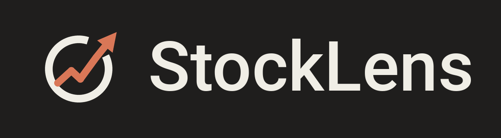

# StockLens



**Név**: a *lens* egyszerre a kamera objektívje (lefotózod a részvényt) és a nagyító, amivel átlátod (minden adat és AI-elemzés). A logó: lencse-gyűrű, amelyből egy emelkedő árfolyamnyíl lép ki.

**Lefotózunk egy részvényt, és az app kiírja róla az összes tudnivalót, a legrészletesebben.**

Egy kódbázis, öt platform: **iOS, iPadOS, macOS, Android, Windows** (Flutter).
A felület **44 nyelven** érhető el, az alapértelmezett az angol; a részletes lista és a
koncepció a [`docs/KONCEPCIO.md`](docs/KONCEPCIO.md) fájlban.

## Kinézet és asztali élmény

- **Claude-stílusú felület**: meleg, sötét alaptéma (világos is választható), oldalsáv
  „Új keresés / Előzmények / Beállítások” menüvel, nagy üdvözlő sor és egy lekerekített
  keresősáv (ticker vagy cégnév, kép csatolása, kamera). Apple-szerű részletek: rendszerbetű,
  1 px-es finom szegélyek, rejtett natív címsor, húzható fejléc.
- **Előhívás bárhonnan (macOS, Windows)**: `⌥ Space` (Windowson `Ctrl + Alt + Space`) egy
  lebegő, mindig felül lévő gyorskereső sávot hoz elő – mint a Claude macOS-en. Enter: a
  találat a teljes ablakban nyílik meg; Esc vagy kattintás máshova: a sáv eltűnik.
- **Menüsor- / tálcaikon**: Megnyitás, Gyorskeresés, Kilépés.
- **Cégnév-keresés**: nem csak ticker, cégnév is beírható („Apple”, „OTP”).
- **Vágólapról kép**: ⌘V / Ctrl+V a kezdőképernyőn vagy a gyorssávban egy képernyőfotót azonnal felismertet.
- **Beállítások**: a gyorsbillentyű átállítható (kattints, nyomd le az újat), bejelentkezéskori indítás kapcsoló.
- **Kedvencek**: csillag a részvény fejlécében; a kedvencek az oldalsávban és a kezdőképernyőn élő árral jelennek meg.
- **Deviza-átváltás**: az ár a saját pénznemedben is megjelenik (ECB napi árfolyam, a Frankfurter nyílt API-n át, kulcs nélkül); a pénznem a beállításokban választható, alapból a rendszer nyelvéből/országából jön.
- **Grafikon és kimutatások**: 1H–5É árfolyamgrafikon és az utolsó évek jelentett kimutatásai (bevétel, nettó eredmény, eszközök, kötelezettségek, saját tőke, működési cash flow).

## AI-elemzés: hírek összefoglalása és átfogó kép

A részletes nézet tetején egy gombnyomásra elkészül a részvény **AI-elemzése** (Claude):
a friss hírek dátumozott összefoglalása, az üzleti modell, erősségek, **kockázatok és rejtett
tényezők** (ügyfél-koncentráció, szabályozás, perek, hígítás, adósság, részvényalapú
javadalmazás, irányítás…), pénzügyi helyzet, értékeltség, tulajdonosi kör és „mire figyelj”,
forráslinkekkel. A modell megkapja a letöltött adatokat, és – ha engedélyezett – a beépített
webkereséssel maga is utánanéz a legfrissebb eseményeknek. Az elemzés a felhasználó nyelvén
készül, és 12 órán át a készüléken tárolódik, hogy ne kelljen újra fizetni érte.

Vezérlés `--dart-define`-nal: `ANTHROPIC_REPORT_EFFORT` (`low`…`max`, alap `high`),
`ANTHROPIC_WEB_SEARCH` (`true`/`false`, alap `true`).

## Hogyan működik

1. **Kép** – kamera vagy galéria (asztali gépen fájlválasztó).
2. **Felismerés** – a kép a Claude API látás-képességével strukturált JSON-ná alakul:
   ticker, cégnév, tőzsde, megbízhatóság, mit látott a képen. Papír részvény, bróker-app
   képernyője, újság és céglogó egyformán működik.
3. **Adatok** – a tickerhez árfolyam, cégprofil, értékelési és pénzügyi mutatók, osztalék,
   elemzői konszenzus és hírek töltődnek (Finnhub), szekciónként, hibatűrően.
4. **Megjelenítés** – részletes, szekciókra bontott nézet a felhasználó nyelvén és
   számformátumában.

API-kulcs nélkül az app **demó módban** indul (AAPL, MSFT, NVDA, OTP mintaadatokkal), így a
felület kulcs nélkül is végigjárható.

## Előnézet a böngészőben

Natív buildet a fejlesztői munkamenetben nem lehet készíteni, ezért minden lezárt lépés után
a web-build frissül egy privát Artifact-oldalon (a linket a chatben adjuk át). Helyben:

```bash
flutter build web --release --no-web-resources-cdn
```

A web csak előnézeti csatorna; a kamera, a gyorsbillentyű és a tálcaikon ott nem elérhető.

## Fejlesztés

Követelmény: [Flutter](https://docs.flutter.dev/get-started/install) 3.47 vagy újabb.

```bash
flutter pub get
flutter gen-l10n                 # fordítások generálása (lib/l10n/arb → lib/l10n/generated)
flutter analyze
flutter test

# futtatás kulcsokkal (a kulcsok soha nem kerülnek a forráskódba)
flutter run --dart-define=ANTHROPIC_API_KEY=sk-ant-... --dart-define=FINNHUB_API_KEY=...
```

Platform-célok: `flutter run -d ios|macos|android|windows` – az iPad ugyanazt az iOS-buildet
kapja adaptív elrendezéssel.

| Beállítás (`--dart-define`) | Jelentés | Alapértelmezés |
|---|---|---|
| `ANTHROPIC_API_KEY` | képfelismerés kulcsa | – (nélküle csak kézi ticker) |
| `ANTHROPIC_MODEL` | használt modell | `claude-opus-5-5` |
| `ANTHROPIC_BASE_URL` | saját proxy éles kiadáshoz | `https://api.anthropic.com` |
| `FINNHUB_API_KEY` | piaci adatok kulcsa | – (nélküle demó mód) |
| `FINNHUB_BASE_URL` | saját proxy éles kiadáshoz | `https://finnhub.io/api/v1` |
| `ANTHROPIC_REPORT_EFFORT` | AI-elemzés alapossága | `high` |
| `ANTHROPIC_WEB_SEARCH` | webkeresés az AI-elemzéshez | `true` |

## Könyvtárszerkezet

```
lib/
  main.dart, app.dart, app_services.dart   belépés, téma, nyelvkezelés, szolgáltatások
  core/        konfiguráció, modellek, hibakódok, formázás, beállítások (téma, előzmények)
  core/desktop asztali integráció: ablak, globális gyorsbillentyű, tálcaikon
  theme/       Claude-stílusú paletta és Material-téma
  widgets/     húzható fejléc, asztali AppBar
  features/
    capture/       kamera + galéria (image_picker)
    recognition/   StockRecognizer interfész, Claude látás, heurisztikus ticker-kereső
    analysis/      StockAnalyst interfész, Claude-elemzés (webkereséssel), lemezes gyorsítótár
    market_data/   MarketDataProvider interfész, Finnhub, demó adatok
    shell/         oldalsávos keret, gyorssáv-mód váltás
    home/          kezdőképernyő (üdvözlő sor + keresősáv), lebegő gyorssáv, jelölt-választó
    stock_detail/  részletes nézet: AI-elemzés, grafikon, ár, azonosítás, értékelés, kimutatások, hírek…
    settings/      nyelvválasztó, névjegy
  l10n/
    arb/           app_<nyelv>.arb – 44 nyelv, a sablon az app_en.arb
    generated/     flutter gen-l10n kimenete (verziókezelt, hogy a build ne függjön tőle)
test/          egységtesztek (parse-olás, ticker-kereső, nyelvfeloldás, ARB-teljesség), widget-tesztek
test/screenshots képernyőképek valódi betűkkel: flutter test --tags screenshot --dart-define=SHOTS=<mappa>
.github/       CI: analyze + test, majd Android / Windows / iOS+macOS build
```

## Új nyelv vagy új szöveg

- Új szöveg: vedd fel az `lib/l10n/arb/app_en.arb` fájlba (helyőrzőkkel, ha kell), majd minden
  `app_<nyelv>.arb`-ba. Az `arb_completeness_test` jelzi, ha valahol hiányzik.
- Új nyelv: `app_<kód>.arb` + egy sor a `lib/l10n/supported_locales.dart` listájában.
  Olyan nyelvnél, amit a Flutter beépített szövegei nem ismernek, a tartalék-delegate
  automatikusan angol rendszer-szövegeket ad.
